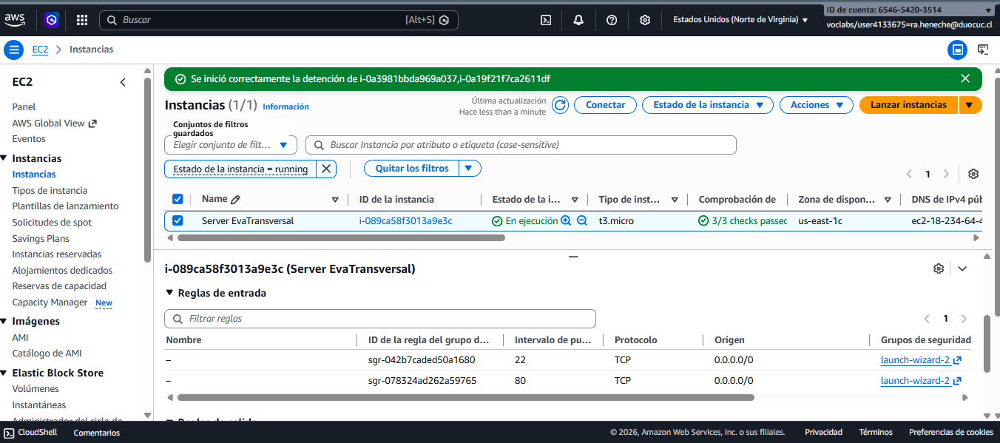
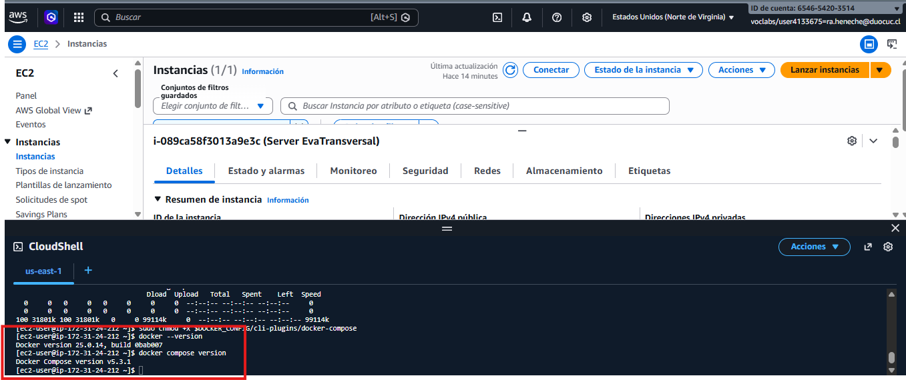
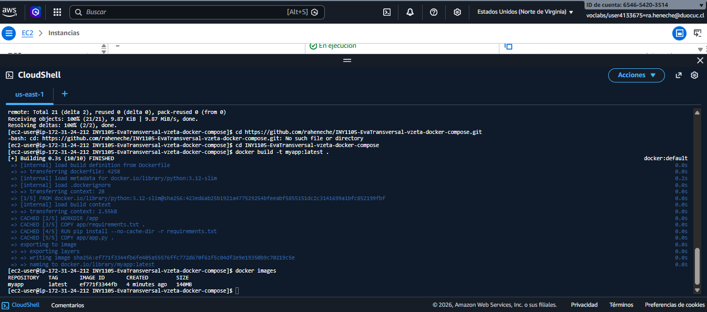
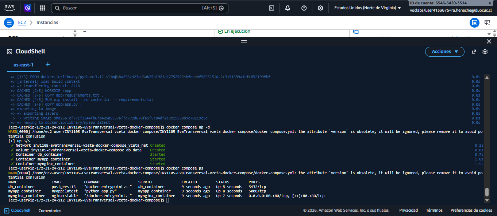
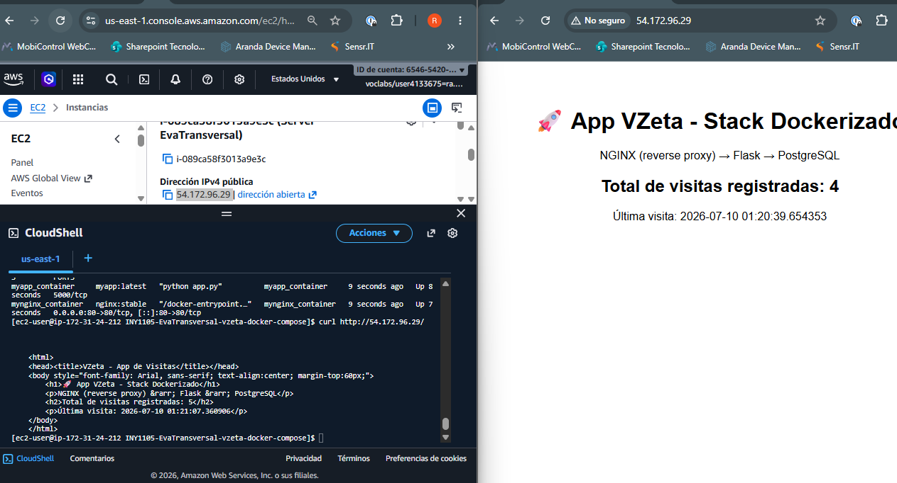
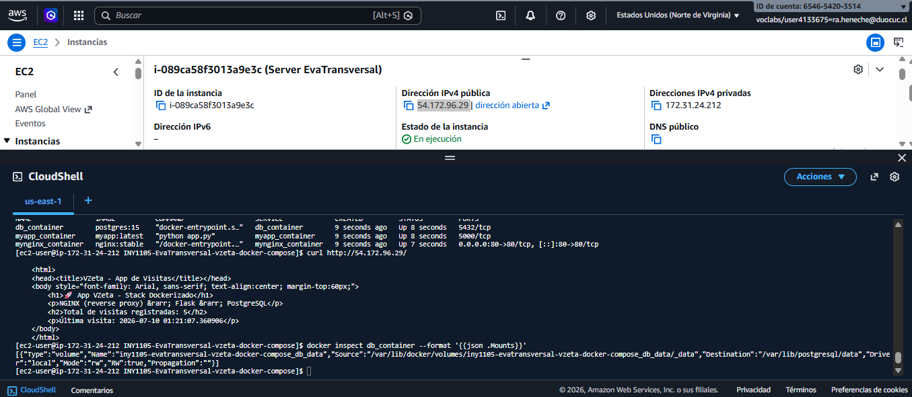
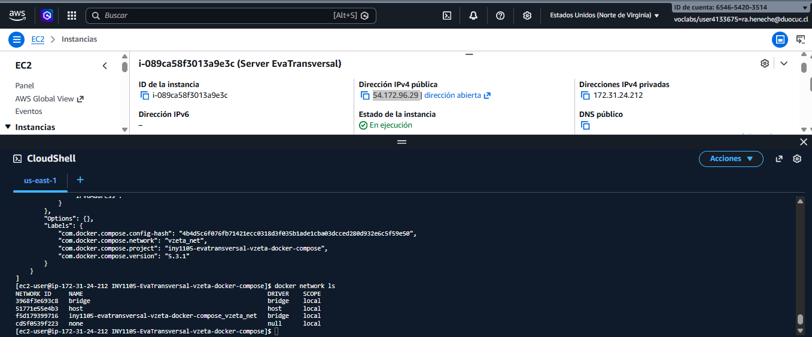
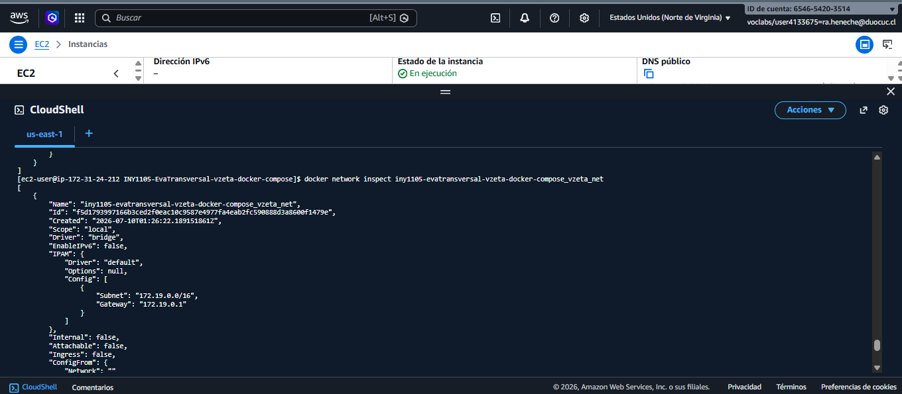
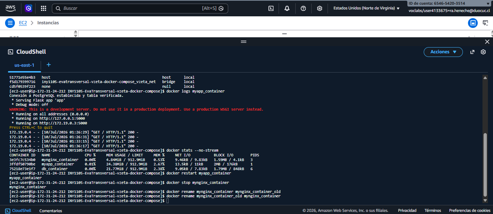
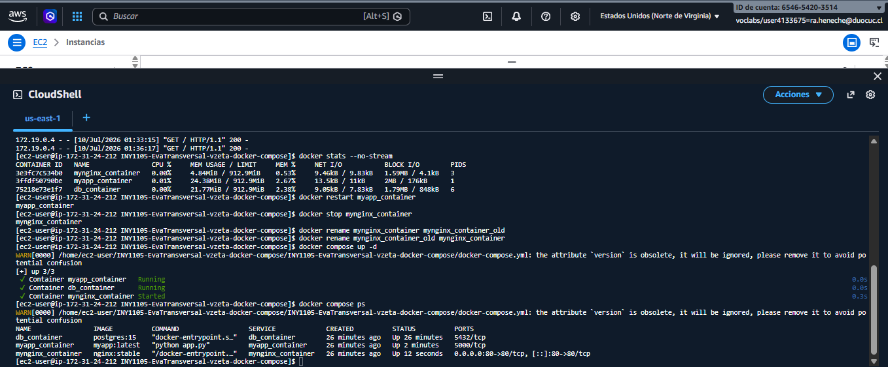

# VZeta — Despliegue de aplicación web contenerizada (Docker + Docker Compose)

**Asignatura:** INY1105 — Infraestructura de Aplicaciones I

---

## 1. Justificación técnica

### 1.1 Contenedores vs. hipervisores (virtualización tradicional)

Para el caso de VZeta se optó por contenedores en lugar de máquinas virtuales
tradicionales sobre un hipervisor. Un hipervisor (VMware ESXi, Hyper-V, KVM)
requiere instalar y licenciar un sistema operativo completo por cada máquina
virtual, además de licenciar en algunos casos el propio hipervisor; cada VM
pesa varios gigabytes y tarda minutos en levantar. Los contenedores, en
cambio, comparten el kernel del sistema operativo anfitrión, no requieren
licenciamiento de un SO por instancia, pesan solo algunos megabytes y
levantan en segundos. En este proyecto la imagen `myapp:latest` (basada en
`python:3.12-slim`) pesa 140 MB y arranca en menos de un segundo, lo que
sería imposible de igualar con una VM completa.

Además, se optó por **Docker Compose** y no por un orquestador como
Kubernetes (EKS/AKS/GKE), porque la infraestructura de VZeta no permite
orquestación avanzada: se trabaja sobre una única instancia EC2 con solo 3
servicios (NGINX, aplicación Flask y PostgreSQL). Docker Compose resuelve
completamente la orquestación a nivel de host —red interna, dependencias de
arranque, volúmenes— sin la complejidad operativa de un clúster de
Kubernetes (control plane, nodos, etcd, RBAC), que solo se justifica cuando
existen múltiples nodos o se requiere alta escala horizontal.

### 1.2 Propuesta de nube pública, privada e híbrida

En este proyecto se utilizó **nube pública** (AWS, vía Academy Learner Lab)
por su costo reducido, elasticidad y rapidez de aprovisionamiento: la
instancia EC2 se crea en minutos y solo se paga mientras está en ejecución.

Se recomendaría **nube privada** si VZeta manejara datos sensibles con
requisitos normativos estrictos (por ejemplo, información financiera o de
salud de clientes) que exijan control total sobre el hardware físico y la
ubicación de los datos.

Un esquema **híbrido** sería razonable si VZeta necesitara mantener cierta
infraestructura on-premise por regulación o continuidad de negocio, mientras
usa la nube pública para absorber picos de demanda (por ejemplo, campañas de
marketing o temporada alta). Docker facilita este escenario porque la imagen
`myapp:latest` es idéntica en cualquier host que tenga Docker Engine
instalado, sea un servidor propio o una instancia en la nube — el mismo
`docker-compose.yml` se puede levantar en ambos entornos sin modificar el
código de la aplicación.

---

## 2. Arquitectura de la solución

```
Cliente ── HTTP:80 ──▶ [ mynginx_container ] ──▶ [ myapp_container ] ──▶ [ db_container ]
           (nginx reverse proxy)      (Flask · imagen propia)      (PostgreSQL + volumen)

Los tres servicios comparten la red Docker "vzeta_net" (bridge) y se
orquestan con docker-compose sobre una instancia EC2 (t3.micro) con Docker
Engine, desplegada en AWS Academy Learner Lab (región us-east-1).
```

- **mynginx_container** (`nginx:stable`): reverse proxy, único punto de
  entrada público (puerto 80), redirige el tráfico hacia `myapp_container`.
- **myapp_container** (imagen propia `myapp:latest`, `Dockerfile` propio
  sobre `python:3.12-slim`): aplicación Flask que se conecta a PostgreSQL,
  registra cada visita y muestra el contador acumulado.
- **db_container** (`postgres:15`): base de datos con volumen para
  persistencia de datos (`db_data`).

---

## 3. Estructura del repositorio

```
├── app/
│   ├── app.py              # Lógica Flask: conecta a Postgres y cuenta visitas
│   └── requirements.txt    # flask, psycopg2-binary
├── Dockerfile               # Construye la imagen propia de myapp_container
├── nginx/
│   └── default.conf         # Configuración del reverse proxy
├── docker-compose.yml       # Orquesta nginx + myapp + db, red y volumen
├── evidencias/               # Capturas de pantalla del despliegue
└── README.md
```

---

## 4. Procedimiento de despliegue paso a paso

### 4.1 Instancia EC2 (AWS Learner Lab) y Security Group

Se creó una instancia EC2 (`t3.micro`) en la región `us-east-1`, con Security
Group que habilita el puerto **22** (SSH) y el puerto **80** (HTTP) con
origen `0.0.0.0/0`.


*Instancia EC2 "Server EvaTransversal" en ejecución, con reglas de entrada para los puertos 22 (SSH) y 80 (HTTP) abiertas a cualquier origen.*

### 4.2 Instalación de Docker Engine y Docker Compose

Se instaló Docker Engine y el plugin de Docker Compose en la instancia.

```bash
docker --version
docker compose version
```


*Verificación de versiones: Docker version 25.0.14 y Docker Compose version v5.3.1 ya instalados en la instancia EC2.*

### 4.3 Clonar el repositorio y construir la imagen propia

```bash
git clone https://github.com/raheneche/INY1105-EvaTransversal-vzeta-docker-compose.git
cd INY1105-EvaTransversal-vzeta-docker-compose
docker build -t myapp:latest .
docker images
```


*Construcción exitosa de la imagen propia `myapp:latest` (FROM python:3.12-slim) mediante `docker build`, y verificación con `docker images`.*

### 4.4 Levantar el stack completo con Docker Compose

```bash
docker compose up -d
docker compose ps
```


*Los tres contenedores (`db_container`, `myapp_container`, `mynginx_container`) en estado "Up" tras `docker compose up -d`, con el puerto 80 publicado hacia el host.*

### 4.5 Comprobación de funcionamiento

Se accedió a la aplicación tanto por navegador como por `curl`, verificando
que el contador de visitas se incrementa en cada solicitud.

```bash
curl http://<IP_PUBLICA_EC2>/
```


*Respuesta exitosa de la aplicación vía navegador y `curl` contra la IP pública `54.172.96.29`, mostrando el contador de visitas registradas (NGINX → Flask → PostgreSQL funcionando de punta a punta).*

### 4.6 Volumen y persistencia de PostgreSQL

```bash
docker inspect db_container --format '{{json .Mounts}}'
```


*Inspección del contenedor `db_container`: se observa un volumen de tipo `volume` (`iny1105-evatransversal-vzeta-docker-compose_db_data`) montado en `/var/lib/postgresql/data`, con permisos de lectura/escritura (`RW: true`), garantizando persistencia de los datos aunque el contenedor se elimine.*

Adicionalmente, se comprobó la persistencia real ejecutando `docker compose
down` seguido de `docker compose up -d`: el contador de visitas continuó su
conteo (no se reinició a 0), confirmando que los datos sobreviven al ciclo
de vida de los contenedores gracias al volumen `db_data`.

### 4.7 Otras operaciones de inspección (red y contenedor)

```bash
docker network ls
docker network inspect iny1105-evatransversal-vzeta-docker-compose_vzeta_net
```


*Listado de redes Docker (`docker network ls`), donde se identifica la red creada automáticamente por Docker Compose: `iny1105-evatransversal-vzeta-docker-compose_vzeta_net`.*


*Inspección detallada de la red `vzeta_net` (tipo bridge, subred `172.19.0.0/16`), mostrando los tres contenedores conectados: `mynginx_container`, `myapp_container` y `db_container`, cada uno con su IP interna asignada, lo que permite la comunicación entre servicios por nombre.*

### 4.8 Ciclo de vida de contenedores

Se evidenciaron las siguientes operaciones sobre los contenedores en
ejecución: `logs`, `stats`, `restart`, `stop` y `rename`.

```bash
docker logs myapp_container
docker stats --no-stream
docker restart myapp_container
docker stop mynginx_container
docker rename mynginx_container mynginx_container_old
docker rename mynginx_container_old mynginx_container
```


*Evidencia de: logs de `myapp_container` (conexión exitosa a PostgreSQL y solicitudes HTTP recibidas), `docker stats` mostrando el consumo de CPU/memoria de los tres contenedores, `docker restart`, `docker stop` y doble `docker rename` sobre `mynginx_container`.*

Tras estas pruebas, el stack se dejó nuevamente operativo ejecutando
`docker compose up -d`:


*Confirmación de que, tras las pruebas de `restart`, `stop` y `rename`, se ejecutó `docker compose up -d` y `docker compose ps`, dejando los tres contenedores (`db_container`, `myapp_container`, `mynginx_container`) nuevamente en estado "Up" para la revisión final.*

---

## 5. Conclusión

El stack propuesto (NGINX + Flask + PostgreSQL) fue desplegado exitosamente
sobre una instancia EC2 de AWS Learner Lab utilizando Docker Engine y Docker
Compose. Se comprobó el funcionamiento de punta a punta de la aplicación, la
persistencia de datos mediante volúmenes Docker, y se documentaron las
operaciones de inspección y ciclo de vida de contenedores solicitadas.
Docker resultó la solución adecuada para este caso, dado que la
infraestructura de VZeta no permite orquestación avanzada tipo Kubernetes,
y el stack completo puede levantarse con un solo comando (`docker compose up -d`)
sobre cualquier host con Docker Engine instalado.
